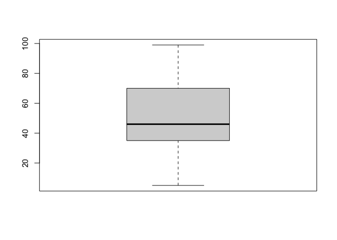
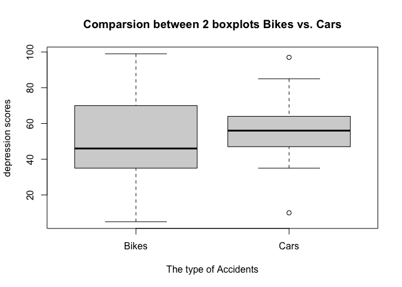

Biostatistical Method HW1
================
Yixiao Sun
2023-09-21

``` r
library(tidyverse)
```

    ## ── Attaching core tidyverse packages ──────────────────────── tidyverse 2.0.0 ──
    ## ✔ dplyr     1.1.3     ✔ readr     2.1.4
    ## ✔ forcats   1.0.0     ✔ stringr   1.5.0
    ## ✔ ggplot2   3.4.3     ✔ tibble    3.2.1
    ## ✔ lubridate 1.9.2     ✔ tidyr     1.3.0
    ## ✔ purrr     1.0.2     
    ## ── Conflicts ────────────────────────────────────────── tidyverse_conflicts() ──
    ## ✖ dplyr::filter() masks stats::filter()
    ## ✖ dplyr::lag()    masks stats::lag()
    ## ℹ Use the conflicted package (<http://conflicted.r-lib.org/>) to force all conflicts to become errors

``` r
df<-c(45, 39, 25, 47, 49, 5, 70, 99, 74, 37, 99, 35, 8, 59)
mean(df)
```

    ## [1] 49.35714

``` r
median(df)
```

    ## [1] 46

``` r
range(df)
```

    ## [1]  5 99

``` r
sd(df)
```

    ## [1] 28.84603

``` r
df_plot<-boxplot(df)
```

<!-- -->

``` r
df2<-c(67, 50, 85, 43, 64, 35, 47, 97, 58, 58, 10, 56, 50)
```

``` r
par(mfrow=c(1,1))
df_twoplots<-boxplot(df,df2, main="Comparsion between 2 boxplots Bikes vs. Cars", ylab = "depression scores", xlab= "The type of Accidents", names=c("Bikes","Cars"))
```

<!-- -->
